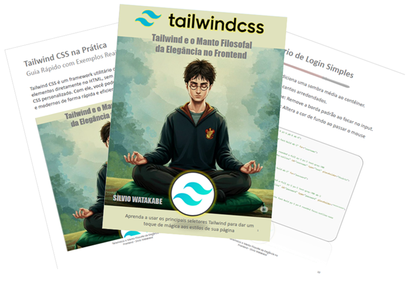

    

-------

# Projeto EBOOK Gerado por I.A.s

 > ℹ️ **NOTE:** Este é o repositório desenvolvido durante o curso no qual estudei na plataforma da [DIO](https://web.dio.me/track/decf433b-9bc9-4ddc-bfd4-639ed8da82d9)

Projeto com o objetivo de gerar um ebook digital com as facilidades das ferramentas de IA. todos os prompts
seguem abaixo.

<a href="./output/ebook - Tailwind e o Manto Filosofal da Elegância no FrontEnd.pdf" title="View PDF now"> 📕Clique aqui para ler</a>

## 💻 Tecnologias utilizadas no projeto

- [ChatGPT](https://chat.openai.com/) 
- [PowerPoint](https://www.microsoft.com/en/microsoft-365/powerpoint)

## 🧠 Prompts

ChatGPT：

|   Ação   | prompt                                                                                                                                                                                                                                                                         |
| :------: | ------------------------------------------------------------------------------------------------------------------------------------------------------------------------------------------------------------------------------------------------------------------------------ |
|  título  | Crie um título de um ebook sobre o tema Tailwind, o ebook é para o nicho de programação e o subnicho é tailwind, um título épico e curto, e tenha uma temática estilo Harry Potter, me liste 10 variações                                                        |
| conteúdo | Faça um texto para ebook, com foco em Tailwind, listando os principais seletores Tailwind com exemplos de códigos: REGRAS: Explique sempre de uma maneira simples, Deixe o texto enxuto, Sempre traga exemplos de código em contextos reais, Sempre deixe um título sugestivo por tópico, númerando título e subtítulo |

## ✨ Features

- Conteúdo gerado via ChatGPT
- Imagens geradas via Gemini

## 📚 Materiais

- Imagens utilizadas em `assets`
- ebook gerado durante as aulas em `output`

## 🛠️ Instruções de execução

Utilize os prompts acima nas ferramentas sugeridas para gerar o material base e utilize uma ferramenta de edição de documentos como power point, libreoffice , indesign para diagramação.

## 👨‍💻 Expert

    
    
&nbsp&nbsp&nbspSilvio Watakabe 
    &nbsp&nbsp
    <a href="https://github.com/silvio-swat">
    GitHub</a>&nbsp;|&nbsp;
    <a href="https://www.linkedin.com/in/swat2023">LinkedIn</a>

  

---

⌨️ por [Silvio Watakabe](https://github.com/silvio-swat)
